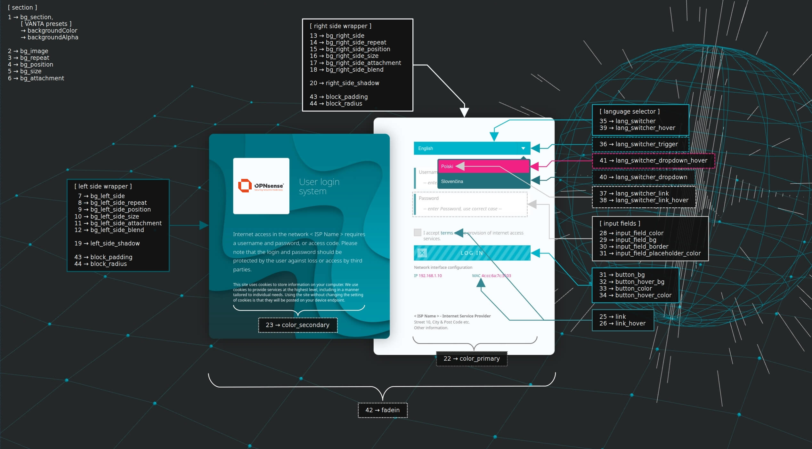

If you like my work and appreciate my commitment, you can buy me a coffee.

If you want to customize this template to your own needs, please contact me! ( <a href="mailto:mix@proask.pl">mix@proask.pl</a> ) I offer professional help in customizing solutions that perfectly match your requirements. Write what you need, and together we will create something exceptional! 🚀

<h3>What is a Captive Portal?</h3>

A Captive Portal allows you to force authentication or redirect to a clickable page to access the network. This is commonly used in hotspot networks, but is also widely used in corporate networks or small local area networks (e.g. shopping malls, restaurants, hotels, airports, etc.) as an additional layer of security for wireless or internet access.

OPNsense’s unique template manager makes setting up your own login page an easy task. At the same time it offers additional functionalities, such as:

<ul>
	<li>URL redirection</li>
	<li>Option for your own Pop-up</li>
	<li>Custom Splash page</li>
</ul>

To read more about the captive portal, I suggest you have a look here: <a href="https://docs.opnsense.org/manual/captiveportal.html?highlight=captive%20portal">https://docs.opnsense.org/manual/captiveportal.html?highlight=captive%20portal</a> meanwhile, I will focus on the template.

&nbsp;

&nbsp;

The captive portal templates that I have seen so far most often lack multilingual support. I've always wondered why it should only be in English or only in one language at all? Well, let's look below. This template supports multilingualism, checks your preferred browser language, saves a cookie with information about which language was read or which language you chose using the selector. Uses language translations saved in the <strong>xx.json</strong> file. So, according to the layout, you can prepare your own translation, which you later have to declare in the <strong>settings.json</strong> file in the <strong>config</strong> directory.

The first (and probably most important) "default_lang" key specifies what language will be loaded by default when the Captive Portal client's web browser's preferred language is different from the languages ​​supported by the platform.

<blockquote>"default_lang": "en"</blockquote>

In the current release, the settings key defines the default language that will be loaded in case the client browser language is not available in our available languages ​​configuration (list below)

<blockquote>"langs": {  "en":"English",  "pl":"Polski",  "sk": "Slovenčina"  };</blockquote>

and (parameters necessary to display the logged-in user's session)

<blockquote>"langs_iso": {  "en":"en-GB",  "pl":"pl-PL",  "sk": "sk-SK"  };</blockquote>

Based on the keys of the langs variable object, the template will automatically determine whether it should display the LTR or RTL content.

If only one translation language is defined in the "langs" group, then the language switcher will not be included in the layout. The language translation will be based on the language defined in the "default_lang" key.

The base64 logo is set in the <strong>settings.json</strong> file. Due to the universal application, the frame of the image of the logo must keep the proportions of a square.

Login Control Configuration Group <strong>"login"</strong> 

A mechanism that allows a specified number of failed login attempts. After exceeding the allowed number of attempts, the ability to log in will be blocked for a specified period of time.

Of course, this is not a perfect protection against an attempt to force credentials, but the Captive Portal in OPNsense does not yet have a similar protection.

<blockquote>
	
"login": {

	<table style="width: 100%;">
		<tbody>
			<tr>
				<td>"control": false,</td>
				<td>false - disabled, true - enabled</td>
			</tr>
			<tr>
				<td>"attempts": 3,</td>
				<td>Allowed number of login attempts</td>
			</tr>
			<tr>
				<td>"delay": 10,</td>
				<td>Time in minutes that must elapse before the next login</td>
			</tr>
		</tbody>
	</table>
	
},

</blockquote>

&nbsp;

Layout Configuration Group <strong>"layout"</strong> 

Enables or disables the required consent to the provisions contained in the ISP provider's Regulations.

Redirection url address. If the value is not set or the set value is not a valid url address, the redirection functionality to the specified address will not be implemented.

<blockquote>
	
"layout": {  "enable_rules": true,  "redirect_url": ""  },

</blockquote>

&nbsp;

<h4>Rest of the setup</h4>

CSS Configuration Group <strong>"css_params"</strong> 

<blockquote>
	
"css_params": {

	<table style="width: 100%;">
		<tbody>
			<tr>
				<td>"bg_section": "#252828",</td>
				<td>←&nbsp;1&nbsp;→</td>
				<td>Background color of the entire section</td>
			</tr>
			<tr>
				<td>"bg_image": "",</td>
				<td>←&nbsp;2&nbsp;→</td>
				<td>Illustration as background (used regardless of the color set in <strong>bg_section</strong>)</td>
			</tr>
			<tr>
				<td>"bg_repeat": "no-repeat",</td>
				<td>←&nbsp;3&nbsp;→</td>
				<td>Set the repeatability of the background illustration (if set in <strong>bg_image</strong>)</td>
			</tr>
			<tr>
				<td>"bg_position": "center center",</td>
				<td>←&nbsp;4&nbsp;→</td>
				<td>Set the position of the background illustration (if set in <strong>bg_image</strong>)</td>
			</tr>
			<tr>
				<td>"bg_size": "cover",</td>
				<td>←&nbsp;5&nbsp;→</td>
				<td>Coverage of the background illustration surface (if set in <strong>bg_image</strong>)</td>
			</tr>
			<tr>
				<td>"bg_attachment": "",</td>
				<td>←&nbsp;6&nbsp;→</td>
				<td>Sets the scrolling of the background image (if set in <strong>bg_image</strong>)</td>
			</tr>
			<tr>
				<td>"bg_left_side": "url('/images/bg_left_side.png')",</td>
				<td>←&nbsp;7&nbsp;→</td>
				<td>Illustration as background of the <strong>left side</strong> of the login portal</td>
			</tr>
			<tr>
				<td>"bg_left_side_repeat": "no-repeat",</td>
				<td>←&nbsp;8&nbsp;→</td>
				<td>Set the repeatability of the background illustration of the <strong>left side</strong> of the login portal</td>
			</tr>
			<tr>
				<td>"bg_left_side_position": "top left",</td>
				<td>←&nbsp;9&nbsp;→</td>
				<td>Position of the <strong>left side</strong> background image of the login portal</td>
			</tr>
			<tr>
				<td>"bg_left_side_size": "cover",</td>
				<td>←&nbsp;10&nbsp;→</td>
				<td>Coverage of the <strong>left side</strong> of the login portal background illustration surface</td>
			</tr>
			<tr>
				<td>"bg_left_side_attachment": "",</td>
				<td>←&nbsp;11&nbsp;→</td>
				<td>Setting the scrolling background image of the <strong>left side</strong> of the login portal</td>
			</tr>
			<tr>
				<td>"bg_left_side_blend": "linear-gradient(180deg, #005f6b4d 0%, #005f6bbf 83.85%)",</td>
				<td>←&nbsp;12&nbsp;→</td>
				<td>Setting the background blend of the <strong>left side</strong> of the login portal - in this case it allows you to cover the background illustration of the left side of the login portal with a linear gradient</td>
			</tr>
			<tr>
				<td>"bg_right_side": "rgba(249, 253, 255, 1)",</td>
				<td>←&nbsp;13&nbsp;→</td>
				<td>Illustration as background of the <strong>right side</strong> of the login portal</td>
			</tr>
			<tr>
				<td>"bg_right_side_repeat": "no-repeat",</td>
				<td>←&nbsp;14&nbsp;→</td>
				<td>Set the repeatability of the background illustration of the <strong>right side</strong> of the login portal</td>
			</tr>
			<tr>
				<td>"bg_right_side_position": "top left",</td>
				<td>←&nbsp;15&nbsp;→</td>
				<td>Position of the <strong>right side</strong> background image of the login portal</td>
			</tr>
			<tr>
				<td>"bg_right_side_size": "cover",</td>
				<td>←&nbsp;16&nbsp;→</td>
				<td>Coverage of the <strong>right side</strong> of the login portal background illustration surface</td>
			</tr>
			<tr>
				<td>"bg_right_side_attachment": "",</td>
				<td>←&nbsp;17&nbsp;→</td>
				<td>Setting the scrolling background image of the <strong>right side</strong> of the login portal</td>
			</tr>
			<tr>
				<td>"bg_right_side_blend": "",</td>
				<td>←&nbsp;18&nbsp;→</td>
				<td>Setting the background blend of the <strong>right side</strong> of the login portal - in this case it allows you to cover the background illustration of the left side of the login portal with a linear gradient</td>
			</tr>
			<tr>
				<td>"left_side_shadow": "0 0 40px 0 rgba(0, 0, 0, .35)",</td>
				<td>←&nbsp;19&nbsp;→</td>
				<td>Shadow under <strong>left side</strong> of login portal</td>
			</tr>
			<tr>
				<td>"right_side_shadow": "0 0 40px 0 rgba(0, 0, 0, .35)",</td>
				<td>←&nbsp;20&nbsp;→</td>
				<td>Shadow under <strong>right side</strong> of login portal</td>
			</tr>
			<tr>
				<td>"bg_alternate": "#818a91",</td>
				<td>←&nbsp;21&nbsp;→</td>
				<td>Alternate background color - used in buttons as the background color and text fields as the border color</td>
			</tr>
			<tr>
				<td>"color_primary": "#7a7a7a",</td>
				<td>←&nbsp;22&nbsp;→</td>
				<td>Main text color</td>
			</tr>
			<tr>
				<td>"color_secondary": "#ffffff",</td>
				<td>←&nbsp;23&nbsp;→</td>
				<td>Text secondary color</td>
			</tr>
			<tr>
				<td>"color_alternate": "#373a3c",</td>
				<td>←&nbsp;24&nbsp;→</td>
				<td>Text alternate color</td>
			</tr>
			<tr>
				<td>"link": "#348893",</td>
				<td>←&nbsp;25&nbsp;→</td>
				<td>Link color</td>
			</tr>
			<tr>
				<td>"link_hover": "#f12184",</td>
				<td>←&nbsp;26&nbsp;→</td>
				<td>Link hover color</td>
			</tr>
			<tr>
				<td>"input_field_color": "#e8e8e8",</td>
				<td>←&nbsp;27&nbsp;→</td>
				<td>Input field text color</td>
			</tr>
			<tr>
				<td>"input_field_bg": "#ffffff",</td>
				<td>←&nbsp;28&nbsp;→</td>
				<td>Input field background color&nbsp;</td>
			</tr>
			<tr>
				<td>"input_field_border": "rgba(145, 156, 167, .27)",</td>
				<td>←&nbsp;29&nbsp;→</td>
				<td>Input field border color</td>
			</tr>
			<tr>
				<td>"input_field_placeholder_color": "#4ca1af",</td>
				<td>←&nbsp;30&nbsp;→</td>
				<td>Input field placeholder color</td>
			</tr>
			<tr>
				<td>"button_bg": "#00b5cb",</td>
				<td>←&nbsp;31&nbsp;→</td>
				<td>Button background color</td>
			</tr>
			<tr>
				<td>"button_hover_bg": "#f12184",</td>
				<td>←&nbsp;32&nbsp;→</td>
				<td>Button hover background color</td>
			</tr>
			<tr>
				<td>"button_color": "#ffffff",</td>
				<td>←&nbsp;33&nbsp;→</td>
				<td>Button text color</td>
			</tr>
			<tr>
				<td>"button_hover_color": "#ffffff",</td>
				<td>←&nbsp;34&nbsp;→</td>
				<td>Button hover text color</td>
			</tr>
			<tr>
				<td>"lang_switcher": "#00b5cb",</td>
				<td>←&nbsp;35&nbsp;→</td>
				<td>Language selector switch</td>
			</tr>
			<tr>
				<td>"lang_switcher_trigger": "#009db1",</td>
				<td>←&nbsp;36&nbsp;→</td>
				<td>Language selector switch trigger</td>
			</tr>
			<tr>
				<td>"lang_switcher_link": "#ffffff",</td>
				<td>←&nbsp;37&nbsp;→</td>
				<td>Language selector switch link color</td>
			</tr>
			<tr>
				<td>"lang_switcher_link_hover": "#ffffff",</td>
				<td>←&nbsp;38&nbsp;→</td>
				<td>Language selector switch link hover color</td>
			</tr>
			<tr>
				<td>"lang_switcher_hover": "#f12184",</td>
				<td>←&nbsp;39&nbsp;→</td>
				<td>Language selector switch link background hover color</td>
			</tr>
			<tr>
				<td>"lang_switcher_dropdown": "#216f7a",</td>
				<td>←&nbsp;40&nbsp;→</td>
				<td>Language selector switch dropdown background color</td>
			</tr>
			<tr>
				<td>"lang_switcher_dropdown_hover": "#f12184",</td>
				<td>←&nbsp;41&nbsp;→</td>
				<td>Language selector switch dropdown background hover color</td>
			</tr>
			<tr>
				<td>"fadein": "0.5s",</td>
				<td>←&nbsp;42&nbsp;→</td>
				<td>Duration fading to opaque the layout once it's fully loaded</td>
			</tr>
			<tr>
				<td>"block_padding": "50px",</td>
				<td>←&nbsp;43&nbsp;→</td>
				<td>Padding used on left and right column</td>
			</tr>
			<tr>
				<td>"block_radius": "15px"</td>
				<td>←&nbsp;44&nbsp;→</td>
				<td>Left and right column content wrapper border radius</td>
			</tr>
		</tbody>
	</table>
	
};

</blockquote>

Animate Configuration Group <strong>"animate"</strong> 

<blockquote>
	
"animate": {

	<table style="width: 100%;">
		<tbody>
			<tr>
				<td>"effect": "globe",</td>
				<td>Selected animation</td>
			</tr>
			<tr>
				<td>"params": {</td>
				<td>Common parameters for all effects</td>
			</tr>
			<tr>
				<td style="padding-left: 30px;">"el": "#animate-js",</td>
				<td>CSS id where the animation will be embedded</td>
			</tr>
			<tr>
				<td style="padding-left: 30px;">"bg_position": "center center",</td>
				<td>Set the position of the background</td>
			</tr>
			<tr>
				<td style="padding-left: 30px;">"mouseControls": true,</td>
				<td>Controlling animation by mouse movement</td>
			</tr>
			<tr>
				<td style="padding-left: 30px;">"touchControls": true,</td>
				<td>Controlling animation by swiping on the touch screen</td>
			</tr>
			<tr>
				<td style="padding-left: 30px;">"gyroControls": false,</td>
				<td>Controlling animations with the gyrocompass of mobile devices</td>
			</tr>
			<tr>
				<td style="padding-left: 30px;">"minHeight": 200.00,</td>
				<td>&nbsp;</td>
			</tr>
			<tr>
				<td style="padding-left: 30px;">"minWidth": 200.00</td>
				<td>&nbsp;</td>
			</tr>
			<tr>
				<td>},</td>
				<td>&nbsp;</td>
			</tr>
			<tr>
				<td>"preset": {</td>
				<td>Animation presets</td>
			</tr>
			<tr>
				<td style="padding-left: 30px;">...</td>
				<td>Other configuration keys - here I refer to the Vanta.js online configurator <a href="https://www.vantajs.com/" target="_blank" rel="noopener">https://www.vantajs.com/</a></td>
			</tr>
			<tr>
				<td>}</td>
				<td>&nbsp;</td>
			</tr>
		</tbody>
	</table>
	
};

</blockquote>
<h4>What has changed in the template recently:</h4>
<ul>
	<li>further work on the development of the template is planned, hence the bootstrap 5.3.3 and jquery 3.7.1 libraries have been included, at the same time libraries provided natively by OPNsense will not be used,</li>
	<li>some functions have been separated from the API, their notation has been changed,</li>
	<li>a method for dynamically loading scripts into the template has been added - in the current version it is used by vanta.js dependencies, eventually it will be used more widely,</li>
	<li>the layout has been changed, which was modeled on the Login Screen Design prepared by <strong>Ankur Tripathi</strong> - thanks for your work Ankur!,</li>
	<li>CSS declarations have been improved, rtl support has been improved - unfortunately, I am not sure how to display individual elements in rtl mode, hence if you find an error in this, please feedback - I will correct it,</li>
	<li>particles.js has been abandoned, <strong>Vanta.js</strong> has been implemented in its place - thanks and respect to <a href="https://github.com/tengbao/vanta" target="_blank" rel="noopener"><strong>@tengbao</strong></a> - great job! The following effects are available: <strong>birds</strong>, <strong>cells</strong>, <strong>fog,</strong> <strong>globe</strong>, <strong>halo</strong>, <strong>net</strong>, <strong>rings</strong> and <strong>waves</strong>, which can be configured in a simplified way in settings.json in the <strong>"animate"</strong> key as the preferred <strong>"effect"</strong>, its <strong>"params"</strong> and the <strong>"preset"</strong> of the declared effect. You can view your settings here <a href="https://www.vantajs.com/" target="_blank" rel="noopener">https://www.vantajs.com/</a></li>
	<li>Slovak translation included - thanks to <a href="https://github.com/Gouster4" target="_blank" rel="noopener"><strong>@Gouster4</strong></a>.</li>
	<li>optimizing the code of javascript functions,</li>
	<li>splitting CSS into smaller portions, nesting CSS selectors,</li>
	<li>blocking the ability to log into the system for a specified period of time, after a specified number of possible attempts,</li>
	<li>With the release of version 25 of OPNsense, the logo has been changed - many thanks for the update and vigilance to <a href="https://github.com/OctoCharm" target="_blank" rel="noopener"><strong>@OctoCharm</strong></a>.</li>
</ul>

&nbsp;

<h4>What I plan to change:</h4>
<ul>
	<li>improve or change the language selection switch mechanism,</li>
	<li>implement a method for embedding (or dynamically generating) the layout and its dependencies,</li>
</ul>
