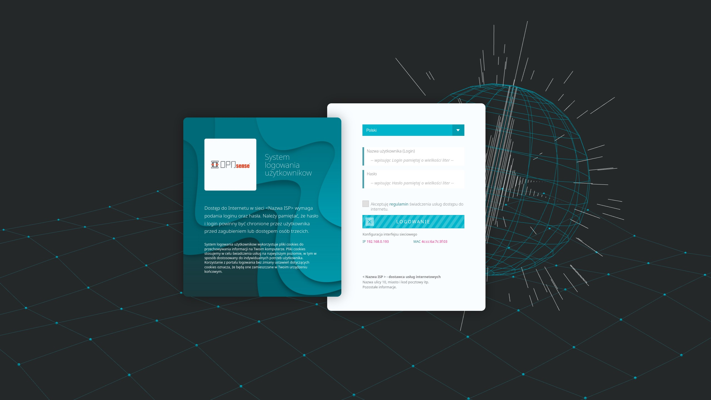

A Captive Portal allows you to force authentication, or redirection to a click through page for network access. This is commonly used on hotspot networks, but is also widely used in corporate networks for an additional layer of security on wireless or Internet access.

OPNsense’s unique template manager makes setting up your own login page an easy task. At the same time it offers additional functionalities, such as:

<ul>
<li>URL redirection</li>
<li>Option for your own Pop-up</li>
<li>Custom Splash page</li>
</ul>

To read more about the captive portal, I suggest you have a look here: <a href="https://docs.opnsense.org/manual/captiveportal.html?highlight=captive%20portal">https://docs.opnsense.org/manual/captiveportal.html?highlight=captive%20portal</a> meanwhile, I will focus on the template.

This template supports multilingualism, checks what is the preferred language of the browser, saves a cookie with information about which language has been read or which has been selected manually. It uses the translations stored in the files lang_xx.json in the js directory. The base64 logo is set in the settings.json file. Due to the universal application, the frame of the image of the logo must keep the proportions of a square.

