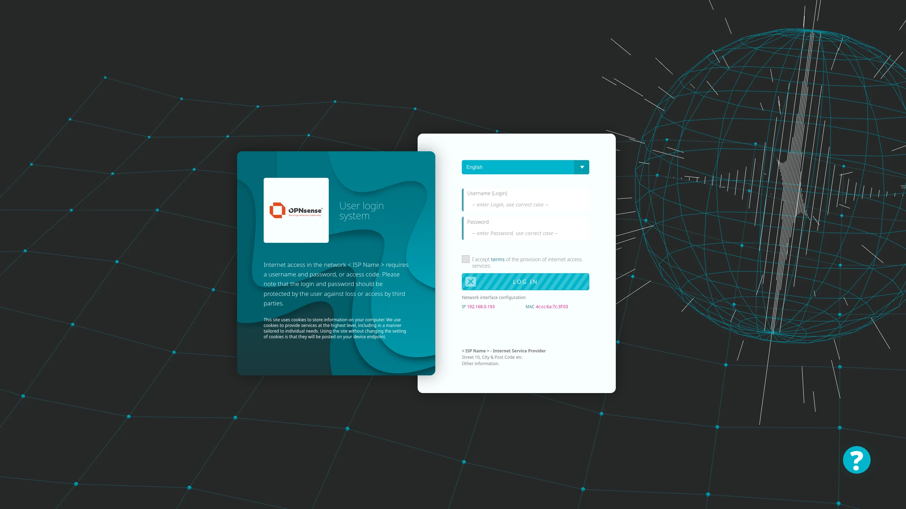
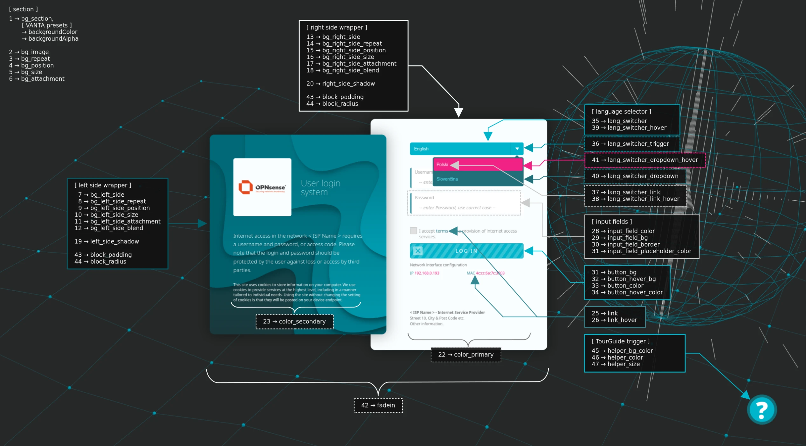

# Captive Portal Template

<p>If you like my work and appreciate my commitment, you can buy me a coffee.</p>
<p><a href="https://www.buymeacoffee.com/mixmint" target="_blank" rel="noopener"></a></p>
<p>If you want to customize this template to your own needs, please contact me! ( <a href="mailto:mix@proask.pl">mix@proask.pl</a> ) I offer professional help in customizing solutions that perfectly match your requirements. Write what you need, and together we will create something exceptional! 🚀</p>

## What is a Captive Portal?

A Captive Portal allows you to force authentication or redirect to a clickable page to access the network. This is commonly used in hotspot networks, but is also widely used in corporate networks or small local area networks (e.g. shopping malls, restaurants, hotels, airports, etc.) as an additional layer of security for wireless or internet access.

OPNsense’s unique template manager makes setting up your own login page an easy task. At the same time it offers additional functionalities, such as:

- URL redirection
- Option for your own Pop-up
- Custom Splash page

To read more about the captive portal, I suggest you have a look here: [OPNsense Captive Portal](https://docs.opnsense.org/manual/captiveportal.html?highlight=captive%20portal)

## 🛡️ GuardianSuit – Project Name (since v2.6.0)

Starting from version 2.6.0, the Captive Portal Template is identified under the name
GuardianSuit.

The name is used for project identification, documentation, and further development.
Earlier versions remain fully compatible, and the change does not affect configuration or usage.

The repository itself will not be replaced or migrated — only its name will change at a later stage.
All history, issues, releases, and existing links will remain preserved by GitHub.

## Demo OPNsense Captive Portal Page
- [Globe animation](https://opnsense.myhome.cool:8001)
- [Globe animation WCAG](https://opnsense.myhome.cool:8002)
- [Birds animation](https://opnsense.myhome.cool:8003)
- [Cells animation](https://opnsense.myhome.cool:8004)
- [Fog animation](https://opnsense.myhome.cool:8005)
- [Halo animation](https://opnsense.myhome.cool:8006)
- [Net animation](https://opnsense.myhome.cool:8007)
- [Rings animation](https://opnsense.myhome.cool:8008)
- [Waves animation](https://opnsense.myhome.cool:8009)

<p>login: demo<br />password: demo</p>

<p></p>

## ⚖️ License and Commercial Version

- Current and future versions of the template (v2.2.0 and above) are free for non-commercial use only.
- A commercial version will be released soon, including additional features and available for use in commercial projects.
- Features available in the free version remain compliant with the non-commercial use policy, and any premium features present in the commercial version will not be included in the GPL/free version.

## 🌐 Multilingual Support

The captive portal templates that I have seen so far most often lack multilingual support. I've always wondered why it should only be in English or only in one language at all? Well, let's look below. This template supports multilingualism, checks your preferred browser language, saves a cookie with information about which language was read or which language you chose using the selector. Uses language translations saved in the **xx.json** file. So, according to the layout, you can prepare your own translation, which you later have to declare in the **settings.json** file in the **config** directory.

The first (and probably most important) "default_lang" key specifies what language will be loaded by default when the Captive Portal client's web browser's preferred language is different from the languages ​​supported by the platform.

```
"default_lang": "en"
```

In the current release, the settings key defines the default language that will be loaded in case the client browser language is not available in our available languages ​​configuration:

```
"langs": {
	"en": "English",
	"pl": "Polski",
	"sk": "Slovenčina",
	"fr": "Français",
	"de": "Deutsch",
	"nl": "Nederlands",
	"no": "Norsk",
	"sv": "Svenska",
	"fi": "Suomi",
	"es": "Español",
	"ca": "Català",
	"ja": "日本語",
	"ko": "한국어",
	"zh": "中文",
	"pt": "Português",
	"it": "Italiano",
	"da": "Dansk",
	"cs": "Čeština",
	"lt": "Lietuvių",
	"lv": "Latviešu",
	"et": "Eesti",
	"el": "Ελληνικά",
	"bg": "Български",
	"ro": "Română",
	"hr": "Hrvatski",
	"ga": "Gaeilge",
	"mt": "Malti",
	"sl": "Slovenščina",
	"hu": "Magyar",
	"is": "Íslenska",
	"sr": "Srpski",
	"bs": "Bosanski",
	"me": "Crnogorski",
	"mk": "Македонски",
	"sq": "Shqip",
	"ka": "ქართული",
	"hy": "Հայերեն",
	"tr": "Türkçe",
	"uk": "Українська",
	"af": "Afrikaans",
	"am": "አማርኛ",
	"ar": "العربية",
	"az": "Azərbaycanca",
	"bn": "বাংলা",
	"cy": "Cymraeg",
	"eu": "Euskara",
	"fa": "فارسی",
	"tl": "Filipino",
	"gl": "Galego",
	"gu": "ગુજરાતી",
	"he": "עברית",
	"hi": "हिन्दी",
	"id": "Bahasa Indonesia",
	"mn": "Монгол",
	"ms": "Bahasa Melayu",
	"nb": "Norsk bokmål",
	"ne": "नेपाली",
	"si": "සිංහල",
	"dz": "རྫོང་ཁ",
	"sw": "Kiswahili",
	"th": "ไทย",
	"uz": "Oʻzbek",
	"ur": "اُردُو",
	"vi": "Tiếng Việt",
	"zu": "Zulu",
	"ky": "Кыргызча",
	"dv": "ދިވެހި",
	"ha": "Hausa",
	"ku": "کوردی (سۆرانی)",
	"kmr": "Kurdî (Kurmancî)",
	"ps": "پښتو",
	"sy": "ܣܘܪܝܝܐ",
	"yi": "ייִדיש",
	"rw": "Kinyarwanda",
	"so": "Soomaali",
	"tg": "Тоҷикӣ",
	"mg": "Malagasy",
	"my": "မြန်မာဘာသာ",
	"km": "ភាសាខ្មែរ",
	"lo": "ພາສາລາວ",
	"ti": "ትግርኛ",
	"rn": "Ikirundi",
	"xh": "IsiXhosa",
	"st": "Sesotho",
	"tn": "Setswana",
	"ss": "siSwati",
	"nd": "isiNdebele",
	"aa": "Qafaraf Af"
};
```
The langs_iso parameter, which was previously included in the configuration, has been removed from the manual settings. In the new template version, ISO values ​​for languages ​​are automatically generated based on the keys defined in the "langs" section.

Based on the keys of the langs variable object, the template will automatically determine whether it should display the LTR or RTL content.

If only one translation language is defined in the "langs" group, then the language switcher will not be included in the layout. The language translation will be based on the language defined in the "default_lang" key.

The base64 logo is set in the **settings.json** file. Due to the universal application, the frame of the image of the logo must keep the proportions of a square.

## Login Control Configuration Group `"login"`

A mechanism that allows a specified number of failed login attempts. After exceeding the allowed number of attempts, the ability to log in will be blocked for a specified period of time.

Of course, this is not a perfect protection against an attempt to force credentials, but the Captive Portal in OPNsense does not yet have a similar protection.

```
"login": {
    "control": false,
    "attempts": 3,
    "delay": 10
},
```

- `control` - false: disabled, true: enabled  
- `attempts` - Allowed number of login attempts  
- `delay` - Time in minutes that must elapse before the next login

## Layout Configuration Group `"layout"`

#### 📋 Offcanvas Menu (since v2.6.0)

Version 2.6.0 introduces a fully configurable Offcanvas Menu, allowing administrators to extend the Captive Portal with additional navigation elements such as documentation, offers, privacy information, or custom links.

#### 🔧 Layout Configuration

The menu can be enabled and positioned directly from the layout configuration group in settings.json:

```
"layout": {
    "enable_rules": true|false,
    "enable_menu": true|false,
    "menu_position": "left|right",
    "redirect_url": ""
},
```

- `enable_rules` – Enables or disables the required consent to the provisions contained in the ISP provider's Regulations.  
- `enable_menu` – Enables or disables the Offcanvas Menu
- `menu_position` – Defines the menu position (left or right)
- `redirect_url` – Redirection url address. If the value is not set or the set value is not a valid url address, the redirection functionality to the specified address will not be implemented.

Menu position automatically adapts to LTR / RTL layouts

On small screens, the menu width adjusts automatically for optimal usability

#### 🌐 Menu Definition in Language Files

All menu elements are defined inside language JSON files (e.g. en.json, pl.json).
This allows full multilingual support and easy customization without touching JavaScript code.

#### 📦 Menu Structure

```
"menu": {
    "title": "GuardianSuit Menu",
    ...
}
```

#### Menu Elements (itemX)

Each menu item is defined as an object with the following properties:

```
"item1": {
    "title": "Internet",
    "icon": "I",
    "href": "https://yourdomain.com/#",
    "target": "_blank"
}
```

- `title` – Text displayed in the menu
- `icon` –
  - single character&nbsp;→ rendered as a colored icon badge
  - HTML entity&nbsp;→ rendered as-is (e.g. &#167;)
- `href` –
  - `string`&nbsp;→ standard link
  - `object`&nbsp;→ modal definition
- `target` – `_blank` or `_self` (in the modal definition the target parameter is not taken into account)

#### Modal-Based Menu Items

Menu items can open modal windows instead of links:

```
"item6": {
    "title": "Privacy Policy",
    "icon": "&#167;",
    "href": {
        "type": "modal",
        "title": "privacy_title",
        "subtitle": "privacy_subtitle",
        "content": "privacy_content",
        "iconText": "&#167;"
    },
    "target": "_self"
}
```

Modal content keys (title, subtitle, content) are resolved from the same language file, ensuring full translation support.

#### 🧩 Menu Groups

Menu items are organized using groups, which control visual grouping and order:

```
"group1": {
    "title": "Offer",
    "items": ["item1", "item2", "item3"]
}
```

Groups define logical sections inside the menu
The items array references previously defined menu items
Order in the array determines display order

#### 🎨 Icon Rendering Rules

Single-character icons automatically receive:
- unique background colors (non-repeating per render)
- automatic text color contrast (dark/light)

HTML entity icons are rendered without background styling

This ensures visual consistency and accessibility without manual styling

#### The appearance of the language selector can be changed by setting values in the layout section.

```
"layout": {
    "lang_layout": "select",
    "lang_flags_dir": "4x3",
},
```

#### Available modes `lang_layout`:

- `flags-select` – a drop-down selector with language names and flags  
- `flags-only-select` – a drop-down selector with flags only (no text)  
- `flags-list` – a list of flags displayed side by side (no text)  
- `select` – a classic drop-down selector with language names (no flags)  

#### Flag directory `lang_flags_dir`:

- `4x3` – a 4:3 flag aspect ratio (standard rectangular)  
- `1x1` – a square flag aspect ratio  

#### Automatic locale and flag mapping `force_locales_data`:

```
"layout": {
    "force_locales_data": true|false,
}
```

- When `true`, updates `langsFlags` and `langISOMap` from the browser's `navigator.language`.  
- Only modifies entries if a region is present (e.g., `en-CA`, `pt-BR`).  
- Leaves two-letter languages (e.g., `en`, `fr`, `es`, `pt`) unchanged.

#### Accessibility options:

```
"layout": {
    "a11y": true|false,
    "a11y_contrast": true|false,
    "a11y_keyboard": true|false,
    "a11y_highlight": true|false,
    "a11y_mono": true|false,
    "a11y_helper": true|false,
    "a11y_helper_breakpoint": 1200,
    "a11y_factor": 0.5,
    "a11y_threshold": 0.5,
},
```

- `a11y` – global accessibility toggle - when false, other options are ignored  
- `a11y_contrast` – automatically adjusts the color contrast of modals and UI elements to make them easier to read, this is based on the `a11y_factor` and `a11y_treshhold` parameters  
- `a11y_keyboard` – enables keyboard shortcut support:
  - ⇧ Shift (left) + ⌥ Alt (left) + U - focus on the Username field  
  - ⇧ Shift (left) + ⌥ Alt (left) + P - focus on the Password field  
  - ⇧ Shift (left) + ⌥ Alt (left) + A - check/uncheck the "I accept the terms and conditions" checkbox  
  - ⇧ Shift (left) + ⌥ Alt (left) + R - opens a modal window with the terms and conditions  
  - ⇧ Shift (left) + ⌥ Alt (left) + I - click the active login button  
  - ⇧ Shift (left) + ⌥ Alt (left) + O - log out  
  - ⇧ Shift (left) + ⌥ Alt (left) + L - click the language switcher trigger  

  **Language shortcuts (⇧ Shift + two letters)**  
  Hold ⇧ Shift and press two letters of the language code (ISO 639-1) at once or one after the other

  Examples:  
  - ⇧ Shift + P + L&nbsp;→ switches to Polish (pl)  
  - ⇧ Shift + E + N&nbsp;→ switches to English (en)  
  - ⇧ Shift + D + E&nbsp;→ switches to Deutsch (de)  
  - ⇧ Shift + F + R&nbsp;→ switches to Français (fr)  
  - ⇧ Shift + E + S&nbsp;→ switches to Español (es)  
  - ⇧ Shift + I + T&nbsp;→ switches to Italiano (it)  

- `a11y_highlight` – highlights the currently focused element (e.g., input, button) to facilitate keyboard navigation  
- `a11y_mono` – monochrome mode reduces the colors in the interface to visually simplify the UI (optional)  
- `a11y_helper` – interactive Accessibility Tour Guide:
  - Provides a step-by-step, WCAG-compliant tour of the portal  
  - Highlights and explains all key elements, including username/password fields, login/logout buttons, the "accept rules" checkbox, and language selector  
  - Fully keyboard-navigable: use arrow keys to move between steps, Enter/Space to confirm, Esc to exit  
  - Dynamically adapts to the selected portal language  
  - Adds visual focus indicators to help users see which element is currently highlighted
- `a11y_helper_breakpoint` - specifies the minimum viewport width (in pixels) at which the Accessibility Tour Guide trigger is displayed. On smaller screens (e.g., smartphones), the trigger is automatically hidden to avoid UI clutter  
- `a11y_factor` – contrast adjustment factor for `a11y_contrast` - higher values = greater contrast increase  
- `a11y_threshold` – contrast threshold – specifies the minimum contrast required between the background and text colors. If the current contrast is below this value, it is automatically adjusted.

## CSS Configuration Group `"css_params"`
<p></p>
<blockquote>
	<p>"css_params": {</p>
	<table style="width: 100%;">
		<tbody>
			<tr>
				<td>"bg_section": "#252828"</td>
				<td>←&nbsp;1&nbsp;→</td>
				<td>Global background color of the entire login section</td>
			</tr>
			<tr>
				<td>"bg_image": ""</td>
				<td>←&nbsp;2&nbsp;→</td>
				<td>Optional background image displayed over <strong>bg_section</strong></td>
			</tr>
			<tr>
				<td>"bg_repeat": "no-repeat"</td>
				<td>←&nbsp;3&nbsp;→</td>
				<td>Defines background image repeat behavior</td>
			</tr>
			<tr>
				<td>"bg_position": "center center"</td>
				<td>←&nbsp;4&nbsp;→</td>
				<td>Position of the global background image</td>
			</tr>
			<tr>
				<td>"bg_size": "cover"</td>
				<td>←&nbsp;5&nbsp;→</td>
				<td>Scaling method of the global background image</td>
			</tr>
			<tr>
				<td>"bg_attachment": ""</td>
				<td>←&nbsp;6&nbsp;→</td>
				<td>Controls background image scroll behavior (fixed / scroll)</td>
			</tr>
			<tr>
				<td>"bg_color_left_side": ""</td>
				<td>←&nbsp;7&nbsp;→</td>
				<td>Background color of the <strong>left panel</strong></td>
			</tr>
			<tr>
				<td>"bg_img_left_side": "url('/images/bg_left_side.png')"</td>
				<td>←&nbsp;8&nbsp;→</td>
				<td>Background image of the <strong>left panel</strong></td>
			</tr>
			<tr>
				<td>"bg_img_left_side_repeat": "no-repeat"</td>
				<td>←&nbsp;9&nbsp;→</td>
				<td>Repeat behavior of the left panel background image</td>
			</tr>
			<tr>
				<td>"bg_img_left_side_position": "top left"</td>
				<td>←&nbsp;10&nbsp;→</td>
				<td>Position of the left panel background image</td>
			</tr>
			<tr>
				<td>"bg_img_left_side_size": "cover"</td>
				<td>←&nbsp;11&nbsp;→</td>
				<td>Scaling method of the left panel background image</td>
			</tr>
			<tr>
				<td>"bg_img_left_side_attachment": ""</td>
				<td>←&nbsp;12&nbsp;→</td>
				<td>Scroll behavior of the left panel background image</td>
			</tr>
			<tr>
				<td>"bg_left_side_blend": "linear-gradient(0deg, #005f6b4d 0%, #005f6bbf 83.85%)"</td>
				<td>←&nbsp;13&nbsp;→</td>
				<td>Gradient overlay blended with the left panel background image</td>
			</tr>
			<tr>
				<td>"logo_bg_color": "rgba(249, 253, 255, 1)"</td>
				<td>←&nbsp;14&nbsp;→</td>
				<td>Background color of the logo container</td>
			</tr>
			<tr>
				<td>"logo_bg_border_radius": "6px 6px 6px 6px"</td>
				<td>←&nbsp;15&nbsp;→</td>
				<td>Border radius of the logo container</td>
			</tr>
			<tr>
				<td>"bg_color_right_side": "rgba(249, 253, 255, 1)"</td>
				<td>←&nbsp;16&nbsp;→</td>
				<td>Background color of the <strong>right panel</strong></td>
			</tr>
			<tr>
				<td>"bg_img_right_side": ""</td>
				<td>←&nbsp;17&nbsp;→</td>
				<td>Background image of the right panel</td>
			</tr>
			<tr>
				<td>"bg_img_right_side_repeat": "no-repeat"</td>
				<td>←&nbsp;18&nbsp;→</td>
				<td>Repeat behavior of the right panel background image</td>
			</tr>
			<tr>
				<td>"bg_img_right_side_position": "top left"</td>
				<td>←&nbsp;19&nbsp;→</td>
				<td>Position of the right panel background image</td>
			</tr>
			<tr>
				<td>"bg_img_right_side_size": "cover"</td>
				<td>←&nbsp;20&nbsp;→</td>
				<td>Scaling method of the right panel background image</td>
			</tr>
			<tr>
				<td>"bg_img_right_side_attachment": ""</td>
				<td>←&nbsp;21&nbsp;→</td>
				<td>Scroll behavior of the right panel background image</td>
			</tr>
			<tr>
				<td>"bg_right_side_blend": ""</td>
				<td>←&nbsp;22&nbsp;→</td>
				<td>Optional gradient overlay for the right panel background</td>
			</tr>
			<tr>
				<td>"left_side_shadow": "0 0 40px 0 rgba(0, 0, 0, .35)"</td>
				<td>←&nbsp;23&nbsp;→</td>
				<td>Shadow cast by the left panel</td>
			</tr>
			<tr>
				<td>"right_side_shadow": "0 0 40px 0 rgba(0, 0, 0, .35)"</td>
				<td>←&nbsp;24&nbsp;→</td>
				<td>Shadow cast by the right panel</td>
			</tr>
			<tr>
				<td>"bg_alternate": "#818a91"</td>
				<td>←&nbsp;25&nbsp;→</td>
				<td>Alternate background color used for UI accents and borders</td>
			</tr>
			<tr>
				<td>"color_primary": "#7a7a7a"</td>
				<td>←&nbsp;26&nbsp;→</td>
				<td>Main text color</td>
			</tr>
			<tr>
				<td>"color_secondary": "#ffffff"</td>
				<td>←&nbsp;27&nbsp;→</td>
				<td>Secondary text color</td>
			</tr>
			<tr>
				<td>"color_alternate": "#373a3c"</td>
				<td>←&nbsp;28&nbsp;→</td>
				<td>Alternate text color (labels, placeholders)</td>
			</tr>
			<tr>
				<td>"link_color": "#348893"</td>
				<td>←&nbsp;29&nbsp;→</td>
				<td>Default link color</td>
			</tr>
			<tr>
				<td>"link_hover_color": "#f12184"</td>
				<td>←&nbsp;30&nbsp;→</td>
				<td>Link hover color</td>
			</tr>
			<tr>
				<td>"input_field_color": "#e8e8e8"</td>
				<td>←&nbsp;31&nbsp;→</td>
				<td>Text color inside input fields</td>
			</tr>
			<tr>
				<td>"input_field_label_color": "#373a3c"</td>
				<td>←&nbsp;32&nbsp;→</td>
				<td>Label color for input fields</td>
			</tr>
			<tr>
				<td>"input_field_bg_color": "#ffffff"</td>
				<td>←&nbsp;33&nbsp;→</td>
				<td>Background color of input fields</td>
			</tr>
			<tr>
				<td>"input_field_border_color": "rgba(145, 156, 167, .27)"</td>
				<td>←&nbsp;34&nbsp;→</td>
				<td>Border color of input fields</td>
			</tr>
			<tr>
				<td>"input_field_border_radius": "5px 0px 0px 5px"</td>
				<td>←&nbsp;35&nbsp;→</td>
				<td>Border radius of input fields</td>
			</tr>
			<tr>
				<td>"input_field_before_bg_color": "#00b5cb"</td>
				<td>←&nbsp;36&nbsp;→</td>
				<td>Background color of input prefix element</td>
			</tr>
			<tr>
				<td>"input_field_after_bg_color": "#00b5cb"</td>
				<td>←&nbsp;37&nbsp;→</td>
				<td>Background color of input suffix element</td>
			</tr>
			<tr>
				<td>"input_field_placeholder_color": "#373a3c"</td>
				<td>←&nbsp;38&nbsp;→</td>
				<td>Placeholder text color</td>
			</tr>
			<tr>
				<td>"button_bg_color": "#00b5cb"</td>
				<td>←&nbsp;39&nbsp;→</td>
				<td>Primary button background color</td>
			</tr>
			<tr>
				<td>"button_hover_bg_color": "#f12184"</td>
				<td>←&nbsp;40&nbsp;→</td>
				<td>Primary button hover background color</td>
			</tr>
			<tr>
				<td>"button_color": "#ffffff"</td>
				<td>←&nbsp;41&nbsp;→</td>
				<td>Primary button text color</td>
			</tr>
			<tr>
				<td>"button_hover_color": "#ffffff"</td>
				<td>←&nbsp;42&nbsp;→</td>
				<td>Primary button hover text color</td>
			</tr>
			<tr>
				<td>"lang_switcher": "#00b5cb"</td>
				<td>←&nbsp;43&nbsp;→</td>
				<td>Language switcher main background</td>
			</tr>
			<tr>
				<td>"lang_switcher_trigger": "#009db1"</td>
				<td>←&nbsp;44&nbsp;→</td>
				<td>Language switcher trigger background</td>
			</tr>
			<tr>
				<td>"lang_switcher_link": "#5aecff"</td>
				<td>←&nbsp;45&nbsp;→</td>
				<td>Language option link color</td>
			</tr>
			<tr>
				<td>"lang_switcher_hover": "#f12184"</td>
				<td>←&nbsp;46&nbsp;→</td>
				<td>Language option hover background</td>
			</tr>
			<tr>
				<td>"lang_switcher_dropdown": "#216f7a"</td>
				<td>←&nbsp;47&nbsp;→</td>
				<td>Language dropdown background</td>
			</tr>
			<tr>
				<td>"lang_switcher_dropdown_hover": "#f12184"</td>
				<td>←&nbsp;48&nbsp;→</td>
				<td>Language dropdown hover background</td>
			</tr>
			<tr>
				<td>"fadein": "0.5s"</td>
				<td>←&nbsp;49&nbsp;→</td>
				<td>Fade-in animation duration after page load</td>
			</tr>
			<tr>
				<td>"block_padding": "50px"</td>
				<td>←&nbsp;50&nbsp;→</td>
				<td>Inner padding of left and right panels</td>
			</tr>
			<tr>
				<td>"left_side_block_radius": "15px 15px 15px 15px"</td>
				<td>←&nbsp;51&nbsp;→</td>
				<td>Border radius of left panel content wrapper</td>
			</tr>
			<tr>
				<td>"right_side_block_radius": "15px 15px 15px 15px"</td>
				<td>←&nbsp;52&nbsp;→</td>
				<td>Border radius of right panel content wrapper</td>
			</tr>
			<tr>
				<td>"helper_bg_color": "#00b5cb"</td>
				<td>←&nbsp;53&nbsp;→</td>
				<td>Background color of the TourGuide helper button</td>
			</tr>
			<tr>
				<td>"helper_color": "#ffffff"</td>
				<td>←&nbsp;54&nbsp;→</td>
				<td>Text/icon color of the TourGuide helper button</td>
			</tr>
			<tr>
				<td>"helper_size": "78px"</td>
				<td>←&nbsp;55&nbsp;→</td>
				<td>Width and height of the TourGuide helper button</td>
			</tr>
			<tr>
			<td>"offcanvas_margin": "15px"</td>
				<td>←&nbsp;56&nbsp;→</td>
				<td>Margin around the offcanvas menu</td>
			</tr>
			<tr>
				<td>"offcanvas_trigger_border_radius": "8px 8px 8px 8px"</td>
				<td>←&nbsp;57&nbsp;→</td>
				<td>Border radius of the offcanvas trigger button</td>
			</tr>
			<tr>
				<td>"offcanvas_trigger_bg_color": "#00b5cb"</td>
				<td>←&nbsp;58&nbsp;→</td>
				<td>Background color of the offcanvas trigger button</td>
			</tr>
			<tr>
				<td>"offcanvas_trigger_bg_hover_color": "#f12184"</td>
				<td>←&nbsp;59&nbsp;→</td>
				<td>Background color of the offcanvas trigger button on hover</td>
			</tr>
			<tr>
				<td>"offcanvas_trigger_color": "#ffffff"</td>
				<td>←&nbsp;60&nbsp;→</td>
				<td>Text/icon color of the offcanvas trigger button</td>
			</tr>
			<tr>
				<td>"offcanvas_trigger_hover_color": "#ffffff"</td>
				<td>←&nbsp;61&nbsp;→</td>
				<td>Text/icon color of the offcanvas trigger button on hover</td>
			</tr>
			<tr>
				<td>"offcanvas_bg_color": "#ffffff"</td>
				<td>←&nbsp;62&nbsp;→</td>
				<td>Background color of the offcanvas menu panel</td>
			</tr>
			<tr>
				<td>"offcanvas_border_radius": "8px 8px 8px 8px"</td>
				<td>←&nbsp;63&nbsp;→</td>
				<td>Border radius of the offcanvas menu panel</td>
			</tr>
			<tr>
				<td>"offcanvas_text_color": "#373a3c"</td>
				<td>←&nbsp;64&nbsp;→</td>
				<td>Main text color inside the offcanvas menu</td>
			</tr>
			<tr>
				<td>"offcanvas_link_bg_color": "transparent"</td>
				<td>←&nbsp;65&nbsp;→</td>
				<td>Background color of offcanvas menu links</td>
			</tr>
			<tr>
				<td>"offcanvas_link_bg_hover_color": "#00b5cb1a"</td>
				<td>←&nbsp;66&nbsp;→</td>
				<td>Background color of offcanvas menu links on hover</td>
			</tr>
			<tr>
				<td>"offcanvas_link_color": "#348893"</td>
				<td>←&nbsp;67&nbsp;→</td>
				<td>Text color of offcanvas menu links</td>
			</tr>
			<tr>
				<td>"offcanvas_link_hover_color": "#f12184"</td>
				<td>←&nbsp;68&nbsp;→</td>
				<td>Text color of offcanvas menu links on hover</td>
			</tr>
		</tbody>
	</table>
	<p>};</p>
</blockquote>

## Modal Configuration Group `"modal"`

<blockquote>
	<p>"modal": {</p>
	<table style="width: 100%;">
		<tbody>
			<tr>
				<td>"auth_failed_header_color": "#f12184"</td>
				<td>Color of the header for the authentication failed modal</td>
			</tr>
			<tr>
				<td>"conn_failed_header_color": "#f12184"</td>
				<td>Color of the header for the connection failed modal</td>
			</tr>
			<tr>
				<td>"show_rules_header_color": "#4ca1af"</td>
				<td>Color of the header when showing ISP rules or regulations modal</td>
			</tr>
			<tr>
				<td>"bg_color": "#ffffff"</td>
				<td>Background color of the modal content area</td>
			</tr>
			<tr>
				<td>"icon_color": "rgba(255, 255, 255, .5)"</td>
				<td>Default color of icons inside the modal</td>
			</tr>
			<tr>
				<td>"overlay_color": "rgba(0,0,0,.3)"</td>
				<td>Background overlay color covering the page when modal is visible</td>
			</tr>
			<tr>
				<td>"timeout": 5000</td>
				<td>Time in milliseconds after which the modal automatically closes (0 = no auto-close)</td>
			</tr>
			<tr>
				<td>"zindex": 1050</td>
				<td>Z-index used for the modal to ensure it appears above other content</td>
			</tr>
		</tbody>
	</table>
	<p>};</p>
</blockquote>

## Animate Configuration Group `"animate"`

<blockquote>
	<p>"animate": {</p>
	<table style="width: 100%;">
		<tbody>
			<tr>
				<td>"effect": "globe",</td>
				<td>Selected animation (available: <strong>birds</strong>, <strong>cells</strong>, <strong>fog,</strong> <strong>globe</strong>, <strong>halo</strong>, <strong>net</strong>, <strong>rings</strong>, <strong>waves</strong>)</td>
			</tr>
			<tr>
				<td>"params": {</td>
				<td>Common parameters for all effects</td>
			</tr>
			<tr>
				<td style="padding-left: 30px;">"el": "#animate-js",</td>
				<td>CSS id where the animation will be embedded</td>
			</tr>
			<tr>
				<td style="padding-left: 30px;">"bg_position": "center center",</td>
				<td>Set the position of the background</td>
			</tr>
			<tr>
				<td style="padding-left: 30px;">"mouseControls": true,</td>
				<td>Controlling animation by mouse movement</td>
			</tr>
			<tr>
				<td style="padding-left: 30px;">"touchControls": true,</td>
				<td>Controlling animation by swiping on the touch screen</td>
			</tr>
			<tr>
				<td style="padding-left: 30px;">"gyroControls": false,</td>
				<td>Controlling animations with the gyrocompass of mobile devices</td>
			</tr>
			<tr>
				<td style="padding-left: 30px;">"minHeight": 200.00,</td>
				<td>&nbsp;</td>
			</tr>
			<tr>
				<td style="padding-left: 30px;">"minWidth": 200.00</td>
				<td>&nbsp;</td>
			</tr>
			<tr>
				<td>},</td>
				<td>&nbsp;</td>
			</tr>
			<tr>
				<td>"preset": {</td>
				<td>Animation presets</td>
			</tr>
			<tr>
				<td style="padding-left: 30px;">...</td>
				<td>Other configuration keys - here I refer to the Vanta.js online configurator <a href="https://www.vantajs.com/" target="_blank" rel="noopener">https://www.vantajs.com/</a></td>
			</tr>
			<tr>
				<td>}</td>
				<td>&nbsp;</td>
			</tr>
		</tbody>
	</table>
	<p>};</p>
</blockquote>

## What has changed in the template recently:

- Further work on the development of the template is planned, hence the bootstrap 5.3.3 and jquery 3.7.1 libraries have been included, at the same time libraries provided natively by OPNsense will not be used
- Some functions have been separated from the API, their notation has been changed
- A method for dynamically loading scripts into the template has been added - in the current version it is used by vanta.js dependencies, eventually it will be used more widely
- The layout has been changed, which was modeled on the Login Screen Design prepared by **Ankur Tripathi**
- CSS declarations have been improved, rtl support has been improved
- Particles.js has been abandoned, **Vanta.js** has been implemented in its place - thanks and respect to [@tengbao](https://github.com/tengbao/vanta) - great job!
The following effects are available: **birds**, **cells**, **fog**, **globe**, **halo**, **net**, **rings** and **waves**, which can be configured in a simplified way in settings.json in the **animate** key as the preferred **effect**, its **params** and the **preset** of the declared effect.
- Slovak translation included - thanks to [@Gouster4](https://github.com/Gouster4).
- Optimizing the code of javascript functions.
- Splitting CSS into smaller portions, nesting CSS selectors.
- Blocking the ability to log into the system for a specified period of time, after a specified number of possible attempts.
- Logo update for OPNsense v25 - many thanks for the update and vigilance to [@OctoCharm](https://github.com/OctoCharm).
- Language selector layout modified.
- New translations generated using AI for multiple languages.
- Expanded digital accessibility support (**WCAG**).
- Introduced a new interactive Accessibility Tour Guide (TourGuide) compliant with WCAG 2.1 AA.
- Automatic locale and flag mapping has been added, updating flags and locales based on the browser's language while keeping two-letter language codes unchanged.
- Added a new **Offcanvas Menu** with configurable position and items.
